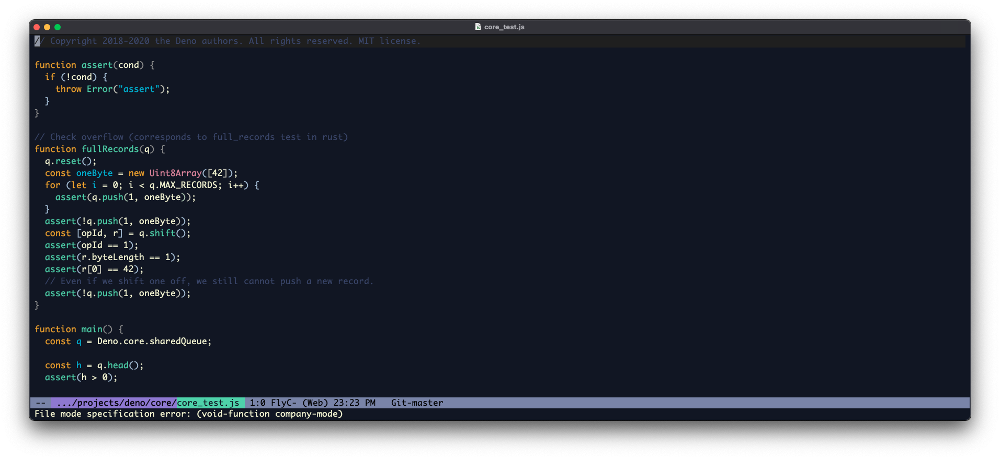

# spaceduck-emacs
A quick and dirty unofficial port of the spaceduck theme <https://github.com/pineapplegiant/spaceduck> for emacs. Generated with <https://github.com/UwUnyaa/vimco>. Lots of hackery at this stage. See below.

## Installation Instructions

Simply add the theme to your `.emacs.d` and add

```emacs-lisp
(load-theme 'spaceduck t)
```

to your emacs configuration file (ex: `init.el`)

## Modline modifications

add the following to your emacs configuration file (ex: `init.el`)

```emacs-lisp
(custom-set-faces
 ;; custom-set-faces was added by Custom.
 ;; If you edit it by hand, you could mess it up, so be careful.
 ;; Your init file should contain only one such instance.
 ;; If there is more than one, they won't work right.
 '(mode-line-buffer-id ((t (:foreground "#5ccc96" nil)))))

```

```emacs-lisp
(defface mode-line-directory
  '((t :background "black" :foreground "#7a5ccc" :bold t))
  "Face used for buffer identification parts of the mode line."
  :group 'mode-line-faces
  :group 'basic-faces)
```

```emacs-lisp
(set-face-attribute 'mode-line nil
                    :background "black"
                    :foreground "#686f9a"
                    ; :box '(:line-width 1 :color "black")
                    :overline nil
                    :underline nil)

(set-face-attribute 'mode-line-inactive nil
                    :background "#2e3459"
                    :foreground "#2e3459"
                    ; :box '(:line-width 1 :color "black")
                    :overline nil)
```
                    
# Screenshot

