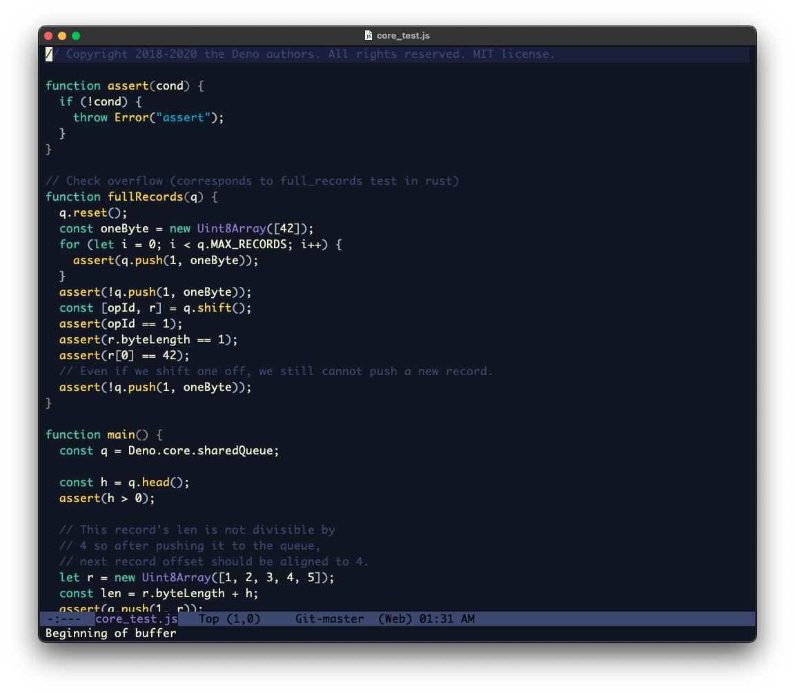

# spaceduck-emacs
A quick and dirty unofficial port of the spaceduck theme <https://github.com/pineapplegiant/spaceduck> for emacs.

## Installation Instructions

Simply add the theme to your `.emacs.d/` folder and add the following to your emacs configuration file (ex: `init.el`)

```emacs-lisp
(load-theme 'spaceduck t)
```

# Screenshot

